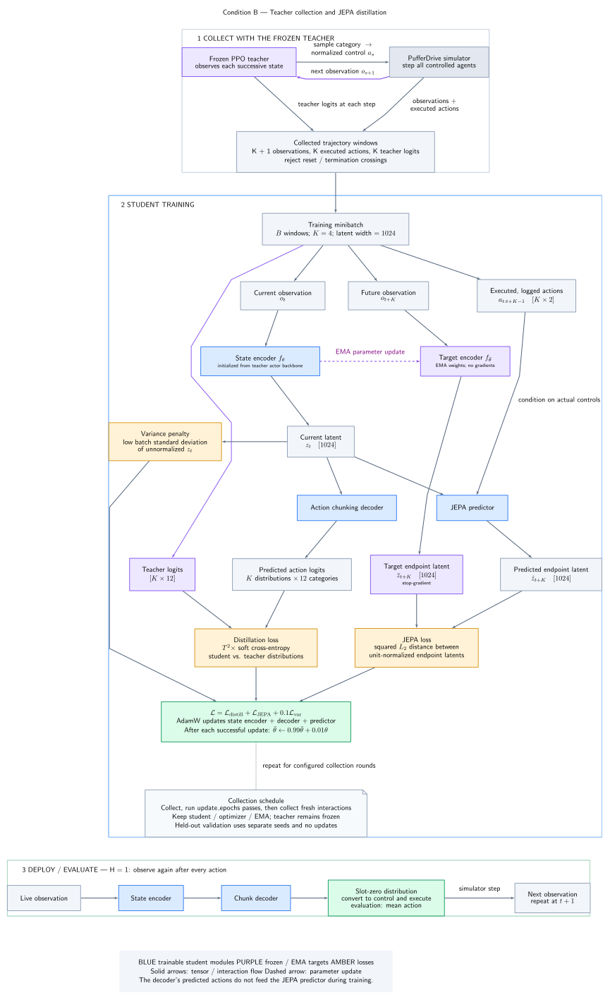

# Condition B pipeline diagram

[Open SVG](condition_b_pipeline.svg) · [Open PDF](condition_b_pipeline.pdf) · [Edit DOT source](condition_b_pipeline.dot)

Three sections show teacher collection, student training, and deployment. Networks are shown as whole modules. The diagram includes observations, executed controls, latent vectors, action distributions, all three losses, stop-gradient, and EMA updates.

## Regenerate

From the repository root:

```bash
project/jepa_distill/design_doc/figures/render_pipeline.sh
```

Requires Graphviz (`dot`), LaTeX (`latex`, `pdflatex`, with PGF/TikZ, `preview`, and `amsmath`), and Poppler (`pdftocairo`). Install the Python conversion dependency once:

```bash
source .venv/bin/activate
python -m pip install -r project/jepa_distill/design_doc/figures/requirements.txt
```

Graphviz computes layout; `dot2tex` and LaTeX typeset the labels into PDF; `pdftocairo` converts the PDF into SVG. The SVG includes vector glyph outlines, so viewers do not need matching math fonts. Invisible edges are layout hints and do not represent computation.

## Edit notation

- Write actual LaTeX in DOT `texlbl` attributes: `$z_t$`, `$\bar z_{t+K}$`, `$\hat z_{t+K}$`.
- Use `\shortstack{description\\$z_t$}` for multiline labels; keep `label` as a plain-text fallback.
- Use square boxes: this converter does not preserve Graphviz's filled rounded paths reliably.

The labels describe the current defaults: K=4, H=1, 12 action categories, 1,024 latent dimensions, loss weights 1/1/0.1, and EMA momentum 0.99. This is an editable schematic, not automatic architecture extraction: update the DOT labels when those design choices change.


